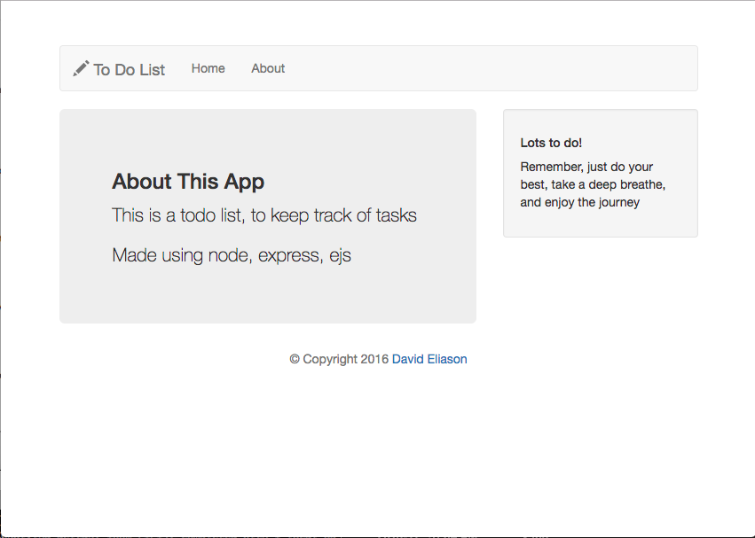

#Node ToDo List
##[David Eliason](http://www.thedavideliason.com)
###November 23rd, 25th, 28th 2016
###Description
>This is an app to keep track of tasks, using node, express, ejs templating, bootstrap, and various middleware modules

###Getting Started

[View it live](https://todowithnode.herokuapp.com/)

Or, you can do it this way, too:

> Using this app on your local computer is simply a matter of cloning the files, downloading the needed dependencies, and then initializing the main file.

1. Clone the repo (e.g. $ git clone https://github.com/davethemaker/node_todolist )
2. In terminal:
  1. $ cd node_todolist
  2. $ npm install
  3. $ node main.js
3. Open browser url to localhost:8080

---

-------

---

Written with :blue_heart: and 

